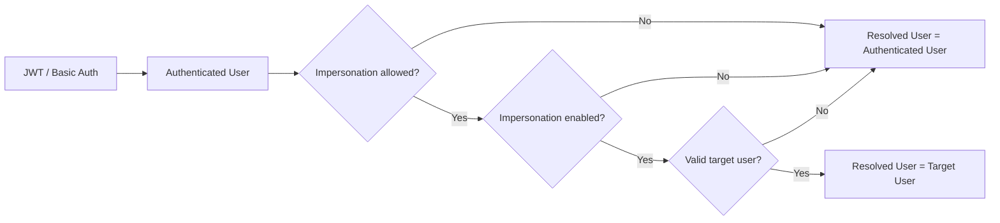
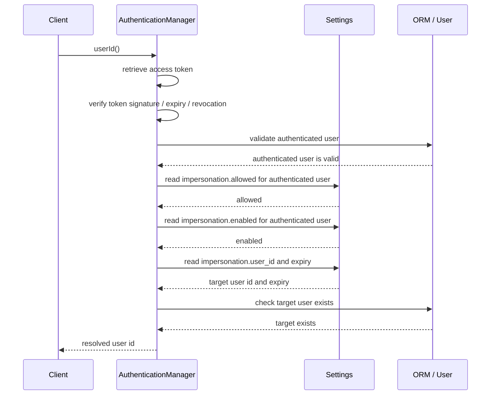
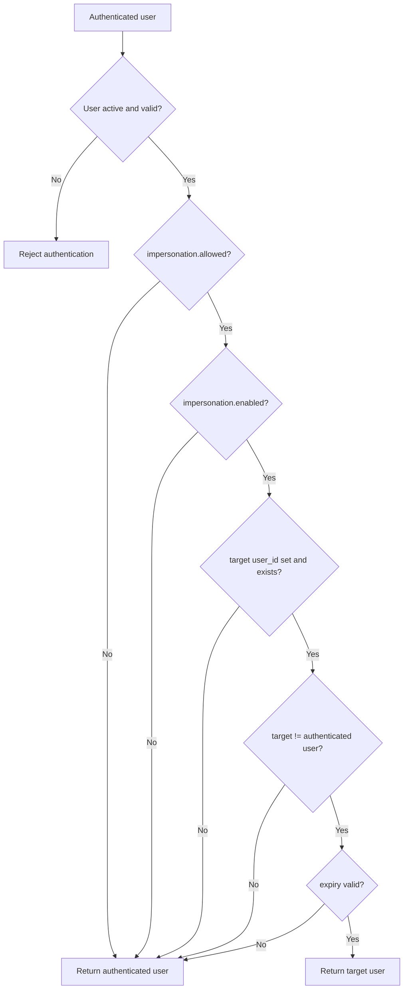
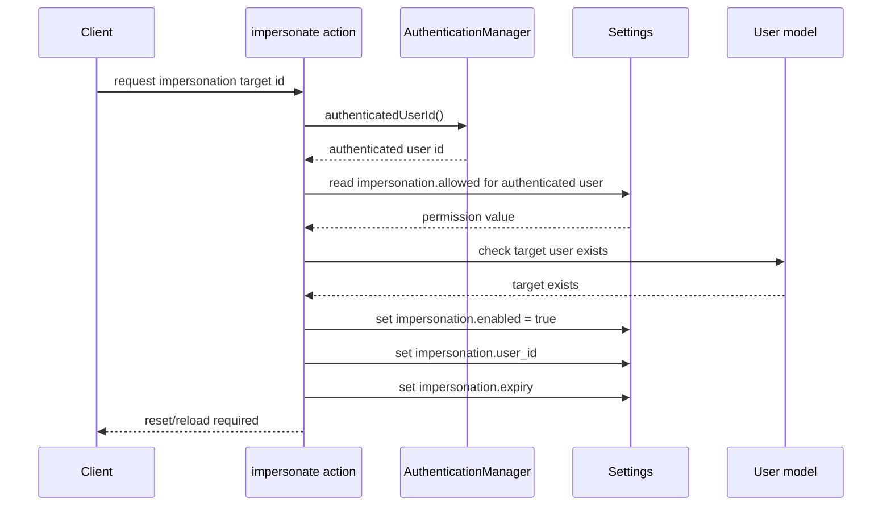
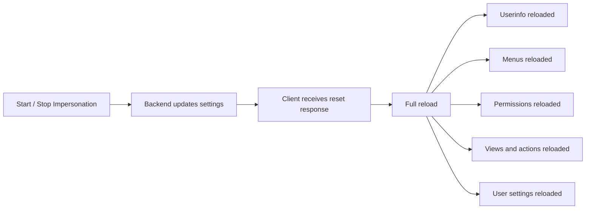

# User Impersonation in eQual

The impersonation mechanism in eQual allows an authorized user to temporarily operate as another user. It is intended for administrative, support, debugging, and assistance workflows where a trusted user needs to reproduce or inspect the application from the perspective of another account.

Impersonation does not replace authentication. The authenticated user remains the user identified by the access token, while the application may resolve another user as the effective application user.

## Core Concepts

| Concept                  | Description                                                                               |
| ------------------------ | ----------------------------------------------------------------------------------------- |
| Authenticated user       | The real user identified by the JWT access token or by Basic Auth.                        |
| Resolved user            | The final user returned by the authentication manager after applying impersonation rules. |
| Target user              | The user account selected as impersonation target.                                        |
| Impersonation permission | The right for an authenticated user to use impersonation.                                 |
| Impersonation state      | Whether impersonation is currently active for the authenticated user.                     |
| Impersonation target     | The user identifier currently configured as the target.                                   |

In normal execution, the authenticated user and the resolved user are identical. When impersonation is allowed, enabled, valid, and linked to an existing target user, the resolved user becomes the target user.

## User Identifiers in AuthenticationManager

The authentication manager distinguishes between the authenticated user and the resolved user.

| Method / Property        | Meaning                                                          | Applies impersonation? |
| ------------------------ | ---------------------------------------------------------------- | ---------------------: |
| `authenticatedUserId()`  | Returns the authenticated user identifier, before impersonation. |                     No |
| `userId()`               | Returns the final resolved user identifier.                      |                    Yes |
| `getUserId()`            | Compatibility alias of `userId()`.                               |                    Yes |
| `$authenticated_user_id` | Internal cache for the authenticated user.                       |                     No |
| `$user_id`               | Internal cache for the resolved user.                            |                    Yes |

The authenticated user is the security reference. It is used to determine whether impersonation is allowed, whether it is active, and which user-scoped impersonation settings must be read.

The resolved user is the identity used by the application once authentication and impersonation resolution are complete.

## Impersonation Settings

Impersonation is controlled through user-scoped settings under the `core.security.impersonation` namespace.

These settings must always be read and written using the authenticated user as context.

| Setting                               |              Type | Scope              | Meaning                                                                         |
| ------------------------------------- | ----------------: | ------------------ | ------------------------------------------------------------------------------- |
| `core.security.impersonation.allowed` |           Boolean | Authenticated user | Indicates whether the authenticated user is allowed to use impersonation.       |
| `core.security.impersonation.enabled` |           Boolean | Authenticated user | Indicates whether impersonation is currently active for the authenticated user. |
| `core.security.impersonation.user_id` |           Integer | Authenticated user | Stores the target user identifier.                                              |
| `core.security.impersonation.expiry`  | Integer timestamp | Authenticated user | Stores the expiration timestamp of the active impersonation.                    |

The setting `impersonation.allowed` represents the permission to use impersonation.

The setting `impersonation.enabled` represents the active state of impersonation. If it is disabled, no impersonation is applied, even if a target user is configured.

The setting `impersonation.user_id` defines the target user. If it is empty, zero, invalid, or equal to the authenticated user, no impersonation is applied.

The setting `impersonation.expiry` defines until when the impersonation remains valid. If it is expired, no impersonation is applied.

## Optional Policy Settings

The impersonation model may later be extended with group-based or role-based restrictions.

| Setting                                             | Meaning                                       |
| --------------------------------------------------- | --------------------------------------------- |
| `core.security.impersonation.allowed_groups`        | Groups allowed to use impersonation.          |
| `core.security.impersonation.allowed_roles`         | Roles allowed to use impersonation.           |
| `core.security.impersonation.allowed_target_groups` | Groups that may be targeted by impersonation. |
| `core.security.impersonation.allowed_target_roles`  | Roles that may be targeted by impersonation.  |

These settings are optional policy extensions. They can be used to restrict who may impersonate users and which users may be selected as targets.

## Authentication and Resolution Flow

When the current user is requested, eQual first retrieves the authenticated user from the access token or Basic Auth. The authenticated user is then validated. Only after this validation does eQual apply impersonation rules.

The important rule is that the authenticated user must be validated before impersonation is applied. The target user only needs to exist.

This allows an administrator to operate as a user account that is inactive, unvalidated, unconfirmed, or otherwise unable to authenticate.

## Resolution Rules

The resolved user is computed from the authenticated user and the impersonation settings.

| Condition                                                         | Result                             |
| ----------------------------------------------------------------- | ---------------------------------- |
| No authenticated user                                             | No resolved user                   |
| Authenticated user invalid                                        | Authentication fails               |
| `impersonation.allowed` is false                                  | Resolved user = authenticated user |
| `impersonation.enabled` is false                                  | Resolved user = authenticated user |
| No target user configured                                         | Resolved user = authenticated user |
| Target user equals authenticated user                             | Resolved user = authenticated user |
| Impersonation expired                                             | Resolved user = authenticated user |
| Target user does not exist                                        | Resolved user = authenticated user |
| Impersonation is allowed, enabled, not expired, and target exists | Resolved user = target user        |

## Starting Impersonation

A dedicated protected action starts impersonation for the authenticated user.

The action receives a target user identifier and an optional duration. It verifies whether the authenticated user is allowed to impersonate and whether the target user exists.

### Start Preconditions

| Check                                                  | Purpose                                                      |
| ------------------------------------------------------ | ------------------------------------------------------------ |
| Authenticated user exists                              | Ensures the action is executed by a real authenticated user. |
| Target user id is valid                                | Prevents invalid target identifiers.                         |
| Target user differs from authenticated user            | Avoids meaningless self-impersonation.                       |
| `impersonation.allowed` is true for authenticated user | Enforces the permission to use impersonation.                |
| Target user exists                                     | Ensures the resolved user can reference a valid account.     |

The target user is intentionally not required to be active, validated, confirmed, or allowed to authenticate.

### Start Effects

| Setting                               | Value                        |
| ------------------------------------- | ---------------------------- |
| `core.security.impersonation.enabled` | `true`                       |
| `core.security.impersonation.user_id` | Target user identifier       |
| `core.security.impersonation.expiry`  | Current timestamp + duration |

The action should return a response indicating that the client must reload or reset the application state.

### Stop Effects

| Setting                               | Value        |
| ------------------------------------- | ------------ |
| `core.security.impersonation.enabled` | `false`      |
| `core.security.impersonation.user_id` | `0` or empty |
| `core.security.impersonation.expiry`  | `0` or empty |
| `core.security.impersonation.allowed` | Unchanged    |

After stopping impersonation, the client must reload or reset the application state so that user-specific data is recomputed for the authenticated user.

## Client-Side Impact

The resolved user affects multiple parts of the application. A partial refresh may leave inconsistent state in the frontend.

When impersonation starts or stops, the frontend should perform a full reload or reset of the application state.

| Application area | Reason                                                        |
| ---------------- | ------------------------------------------------------------- |
| User information | The displayed user context changes.                           |
| Menus            | Available menus may depend on the resolved user.              |
| Permissions      | Access rights must be recomputed.                             |
| Views            | View availability and behavior may differ per user.           |
| Actions          | Available actions may depend on permissions.                  |
| User settings    | Settings are commonly resolved for the current resolved user. |
| Frontend cache   | Cached state may belong to the previous resolved user.        |

