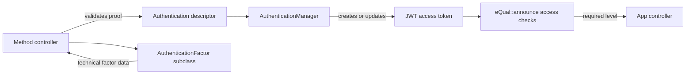

# Authentication Internals

This page describes the implemented authentication architecture for core contributors. App developers should start with the [Authentication guide](../../application-developers/core-development/security-access/authentication.md).

## Scope and Current Boundary

The architecture is generic at the session-state and local-factor layers, but not every backlog target is implemented.

| Capability | Current status |
| :--------- | :------------- |
| Several authentication methods in one session | Implemented through the JWT `auth` claim and `AuthenticationManager::addAuthMethod()`. |
| Step-up without replacing the session identity | Implemented. The new method must belong to the same user. |
| Temporary authentication levels | Implemented through per-entry expiration and `getAuthLevel()`. |
| Generic local factor lifecycle | Implemented by `core\security\AuthenticationFactor`. |
| Passkey factor | Implemented by `core\security\factor\Passkey`. |
| TOTP factor | Implemented by `core\security\factor\TotpKey`. |
| Recovery-code factor | Only the `recovery_code` type is reserved; no specialized class or authentication controller exists. |
| Generic external-provider configuration/account mapping | Not implemented. `AuthProvider` and `AuthProviderAccount` do not currently exist. |
| Federated authentication | A legacy Facebook/Google OAuth action exists and records `fed` at level 1; it is not the generic provider architecture. |
| Hardware-sensitive level-3 policy | Reserved, but no built-in controller currently grants level 3. |

Do not document a reserved type or planned provider class as a supported authentication mechanism.

## Responsibilities

Authentication is split across four layers:



### Method controllers

Method controllers own mechanism-specific verification: password comparison, TOTP generation and attempt limits, WebAuthn challenge/signature verification, email nonce validation, or external-provider calls. After successful verification they produce one normalized descriptor:

```php
$auth_method = [
    'method' => 'otp',
    'level'  => 2,
    'exp'    => time() + constant('AUTH_ACCESS_TOKEN_VALIDITY')
];
```

They also own method-specific settings, challenges, enrollment, factor status checks, and audit-field updates such as `last_used_at` when the implementation maintains them.

### AuthenticationManager

`equal\auth\AuthenticationManager` owns JWT encoding/verification, token discovery, authenticated-user resolution, tracked-token revocation checks, impersonation resolution, normalized authentication-state updates, and effective-level calculation.

It does not provide a registry that maps method names to levels. The method controller currently assigns `level` and `exp` after verifying the guarantees obtained. Centralization therefore applies to representation, mutation, and calculation, not yet to the policy that grants a level.

### Controller access enforcement

`eQual::announce()` enforces authentication before controller parameters are processed. For a non-public HTTP controller it:

1. rejects `private` visibility outside CLI;
2. resolves the current user with `AuthenticationManager::userId()`;
3. evaluates request security policies;
4. checks announced users and groups;
5. reads `access.level`, falling back to the deprecated `access.auth_level` alias;
6. compares it with `AuthenticationManager::getAuthLevel()` and raises `insufficient_auth_level` when necessary.

CLI calls, announcement-only requests, and CORS preflight requests bypass that HTTP access block. Public controllers do not enforce `access.level` because the complete restriction block applies only to non-public controllers.

## JWT Contract

An access-token payload produced by `AuthenticationManager` has this shape:

```json
{
  "id": 42,
  "sub": 42,
  "iat": 1787821200,
  "exp": 1787907600,
  "trk": false,
  "amr": ["pwd", "otp"],
  "auth": [
    {"method": "pwd", "level": 1, "exp": 1787907600},
    {"method": "otp", "level": 2, "exp": 1787821500}
  ]
}
```

Tracked tokens additionally contain `jti`, the identifier of a `core\security\AccessToken` record.

### Claim semantics

| Claim | Semantics |
| :---- | :-------- |
| `id` | Internal eQual user identifier. |
| `sub` | JWT subject; currently the same user identifier. |
| `iat` | Time at which this JWT representation was issued. |
| `exp` | Optional expiration of the JWT itself. When absent, `retrieveAccessToken()` does not apply token expiry. |
| `trk` | Whether server-side revocation must be checked during user resolution. |
| `jti` | ORM `AccessToken` identifier for a tracked token. |
| `amr` | Standard Authentication Methods References: a list of method strings. |
| `auth` | Private eQual authentication state: descriptors used to calculate the effective level. |

`amr` must remain a list of strings. Factor identifiers, secrets, public keys, counters, provider tokens, and method-specific evidence do not belong in `amr` or `auth`. A factor identifier can be written to separate audit logs when traceability requires it.

`amr` is rebuilt from all entries in `auth`, including entries whose authentication expiry has passed. It records the methods carried by the token; it is not the source of truth for current assurance.

### Descriptor invariants

A descriptor must contain these three required fields:

| Key | Required type | Meaning |
| :-- | :------------ | :------ |
| `method` | string | Stable method reference such as `pwd`, `otp`, or `passkey`. |
| `level` | integer | Assurance granted by this authentication event. |
| `exp` | integer | Unix timestamp until which the event contributes to the effective level. |

`token()` accepts either no descriptor or one complete descriptor. `addAuthMethod()` accepts one complete descriptor. Both reject incomplete or incorrectly typed descriptors with an invalid-parameter error.

## Effective Authentication Level

`getAuthLevel()` returns the maximum `level` among descriptors whose `exp` is greater than or equal to the current time:

```php
$level = 0;
foreach($jwt['auth'] ?? [] as $authentication) {
    if($authentication['exp'] >= time()) {
        $level = max($level, $authentication['level']);
    }
}
```

Consequences:

* levels compose by maximum, not by addition or factor count;
* two level-1 entries still yield level 1;
* when a level-2 entry expires, the session falls back to another non-expired entry, commonly level 1;
* a valid JWT with no valid `auth` entry has level 0;
* the legacy format that stored descriptor objects directly in `amr` is not interpreted and yields level 0;
* an HTTP Basic identity resolved without a JWT has level 1;
* passing an invalid or absent explicit token to `getAuthLevel($token)` yields level 0.

Core code must call `getAuthLevel()` rather than infer assurance from `amr` or a factor type.

## Token Lifecycle

### Creating a session

After proof validation, a method controller calls:

```php
$access_token = $auth->token(
    $user_id,
    constant('AUTH_ACCESS_TOKEN_VALIDITY'),
    $auth_method
);
```

This creates a stateless signed JWT. `createAccessToken()` instead creates a `core\security\AccessToken`, records method `token` at level 1, and emits a tracked JWT containing `trk: true` and `jti`.

### Step-up or method refresh

When a valid JWT is already present, the controller must first verify that its `id` matches the user whose proof was just validated. It then calls:

```php
$access_token = $auth->addAuthMethod($auth_method);
```

`addAuthMethod()`:

1. retrieves and verifies the JWT;
2. removes any existing descriptor with the same `method`;
3. appends the new descriptor;
4. reindexes `auth` and rebuilds `amr`;
5. signs the updated payload without changing JWT `iat` or `exp`.

Replacement is keyed only by method name. Re-authenticating with `otp` replaces the previous `otp` entry even if the level changes. The token currently does not distinguish which of several factors of the same type was used.

The same-subject check is performed by the method controllers, not by `addAuthMethod()` itself. Omitting it can attach one user's proof to another user's session.

### Renewal

`renewedToken($validity)` issues a new JWT representation with a new `iat` and token `exp`, while preserving `id`, `sub`, tracking fields, and every existing authentication descriptor unchanged. It rebuilds `amr` from `auth`.

Renewal therefore extends session-token usability but never extends `auth[].exp`. `core_userinfo` uses this mechanism. Expired descriptors are preserved, not pruned.

### Tracked revocation

`retrieveAccessToken()` validates signature, payload `id`, and JWT expiry, but it does not query the ORM. During `userId()`, a token with `trk: true` and `jti` is looked up in `core\security\AccessToken`; a record marked `is_revoked` is rejected.

Stateless tokens cannot be individually revoked through `AccessToken`. They remain usable until JWT expiry, the user no longer passes active-user validation, or a signing-key change. Expiring a descriptor lowers assurance but does not invalidate the JWT identity.

## Request Resolution and Identity

### Token lookup

Unless a token argument is supplied, `retrieveAccessToken()` searches in this order:

1. the `access_token` request cookie;
2. `Authorization: Bearer <token>` when the cookie is absent.

It verifies the signature with `AUTH_SECRET_KEY`, requires a positive payload `id`, and rejects an expired JWT. Decode or signature errors are reported and result in `null` rather than an authenticated payload.

### User resolution

`userId()` then:

1. uses the verified JWT identity, or attempts HTTP Basic authentication when no JWT is usable;
2. checks tracked-token revocation when applicable;
3. verifies that the authenticated `core\User` exists, is not deleted, is validated, and has status `validated` or `confirmed`;
4. caches that identity as `authenticated_user_id`;
5. applies impersonation settings and caches the final `user_id`.

`authenticatedUserId()` returns the real authenticated identity. `userId()` and its compatibility alias `getUserId()` return the resolved identity after impersonation. See [Impersonation](../../application-developers/core-development/security-access/impersonation.md) for the full resolution rules.

Under CLI, `userId()` resolves root without HTTP authentication. The `su()` method directly changes both cached identities for the current call stack and is an internal execution tool, not a user-facing authentication method.

## Local Authentication Factors

`core\security\AuthenticationFactor` contains the properties shared by local, user-owned factors:

* `user_id`, `type`, and a user-facing `label`;
* `status`: `pending`, `active`, `disabled`, or `revoked`;
* `confirmed_at`, `last_used_at`, `revoked_at`, and `revoked_reason`.

Its workflow allows pending factors to be activated, active factors to be disabled or permanently revoked, and disabled factors to be reactivated. Specialized classes can override the transition policies.

Technical data stays in subclasses under `packages/core/classes/security/factor/`:

```text
core\security\AuthenticationFactor
├── core\security\factor\Passkey
│   ├── credential_id
│   ├── credential_public_key
│   ├── signature_counter
│   └── fmt
└── core\security\factor\TotpKey
    ├── secret
    ├── algorithm
    ├── digits
    ├── period
    └── failed_attempts
```

A user can own several factor records and several passkeys. The current `TotpKey` activation policy prevents a user from having more than one active TOTP key, even though several pending, disabled, or revoked records can exist.

An `AuthenticationFactor` is not an access session. `AccessToken` must not store factor secrets or technical credential data. Conversely, an external provider account should not be modeled as a local factor because the provider performs the authentication. The generic provider/account classes described in the backlog remain future work.

## Sign-In Discovery Contract

`core_signin-info` is the capability-discovery endpoint used by the built-in auth App. For an identified user it returns:

* `allowed_methods`, currently beginning with `pwd` and conditionally including `passkey`;
* `allowed_creations`, such as `passkey` or `totpkey`;
* `methods_data`, including the passkey `user_handle`, OTP availability, OTP digit count, and whether password requires OTP;
* `user_data.has_passkey` and `user_data.has_totpkey`;
* active factor descriptors only when the requested user is the current resolved user.

TOTP is expressed as an additional `otp` capability in `methods_data`; it is not a standalone initial method in `allowed_methods`. When password plus TOTP is required, the password controller issues a signed five-minute `mfa_challenge` containing `sub` and `amr: ["pwd"]`. The TOTP controller validates that challenge before issuing the access token.

## Known Implementation Boundaries

Core contributors should account for these current boundaries when extending or hardening the subsystem:

* method-to-level and method-duration policy is assigned in each authentication controller rather than in a central registry;
* built-in descriptors generally use `AUTH_ACCESS_TOKEN_VALIDITY`, even though the token contract supports shorter assurance periods;
* passkeys always grant level 2; attestation format and authenticator guarantees are not yet mapped to level 3;
* passkey challenge JWTs are signed but currently have no explicit type, issue time, or expiration claims; the authentication flow consumes the temporary `user_handle`, while registration does not implement a comparable token-consumption record;
* `addAuthMethod()` does not enforce subject equality itself, so every method controller must perform or otherwise guarantee the same-user check;
* `AuthenticationFactor.last_used_at` is updated by TOTP authentication, but the current passkey controller only updates the signature counter;
* generic external-provider configuration/account entities and recovery-code authentication are not implemented;
* legacy tokens that stored authentication objects directly in `amr` remain identity-bearing until JWT expiry but contribute level 0.

## Adding an Authentication Mechanism

Core implementations should follow this checklist:

1. Decide whether the mechanism is a local factor or an external provider. Add a factor subclass only when eQual owns persistent, user-bound credential material.
2. Keep common lifecycle data in `AuthenticationFactor` and mechanism-specific secrets, public keys, counters, and metadata in the specialized class.
3. Add settings for enablement, enrollment, and mechanism policy, with global and user-scoped resolution where appropriate.
4. Implement challenge generation and proof verification in dedicated controllers. New challenge tokens should be signed, short-lived, typed, bound to the intended user and flow, and protected against replay.
5. After success, build a strict `{method, level, exp}` descriptor. Grant the level from verified guarantees and documented policy, not from an untrusted client value.
6. If a JWT exists, reject a subject mismatch before calling `addAuthMethod()`. Otherwise call `token()` to start a session.
7. Return the updated token using the established secure cookie attributes. Do not hand-edit `amr`, append to `auth`, or extend the JWT lifetime during step-up.
8. Update factor usage/audit fields without leaking factor identifiers or evidence into the JWT.
9. Expose the capability through `core_signin-info`, routes, settings, and the auth App only when the complete flow is usable.
10. Add tests for initial authentication, same-user step-up, mismatched users, descriptor replacement, method expiry/fallback, token expiry, factor states, challenge replay/expiry, and failed-attempt limits.

When a mechanism needs a different assurance duration, set its descriptor `exp` accordingly. Current built-in controllers generally use `AUTH_ACCESS_TOKEN_VALIDITY` for authentication entries; the token model already supports shorter method-specific durations.

## Security Invariants

The following rules should remain true across all authentication methods:

* credential verification happens before a descriptor is created;
* only the authenticated user's proof can update that user's token;
* the effective level is calculated centrally from non-expired `auth` entries;
* controllers declare a minimum level and never interpret `amr` themselves;
* step-up does not extend JWT lifetime;
* token renewal does not extend authentication lifetime;
* factor secrets and identifiers stay out of JWT authentication claims;
* inactive, disabled, or revoked factors cannot authenticate;
* tracked tokens are checked for revocation during identity resolution;
* the real authenticated identity remains distinct from the impersonated application identity.
