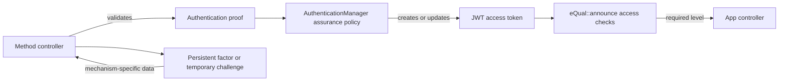

# Authentication Internals

This page describes the implemented authentication architecture for core contributors. App developers should start with the [Authentication guide](../../application-developers/core-development/security-access/authentication.md).

## Scope and Current Boundary

The architecture is generic at the session-state and local-factor layers, but not every backlog target is implemented.

| Capability | Current status |
| :--------- | :------------- |
| Several authentication methods in one session | Implemented through the JWT `auth` claim and `AuthenticationManager::issueAccessToken()`. |
| Step-up without replacing the session identity | Implemented. The new method must belong to the same user. |
| Contextual authentication levels | Implemented by applying the central assurance policy to non-expired proofs in `getAuthLevel()`. |
| Generic local factor lifecycle | Implemented by `core\security\AuthenticationFactor`. |
| Passkey factor | Implemented by `core\security\factor\Passkey`. |
| TOTP factor | Implemented by `core\security\factor\TotpKey`. |
| Email OTP challenge | Implemented by `core\security\challenge\EmailOtpChallenge`; it is temporary and is not an authentication factor. |
| Recovery-code factor | Only the `recovery_code` type is reserved; no specialized class or authentication controller exists. |
| Generic external-provider configuration/account mapping | Not implemented. `AuthProvider` and `AuthProviderAccount` do not currently exist. |
| Federated authentication | A legacy Facebook/Google OAuth action exists and records a `fed` proof; it is not the generic provider architecture. |
| Hardware-sensitive level-3 policy | Reserved, but no built-in controller currently grants level 3. |

Do not document a reserved type or planned provider class as a supported authentication mechanism.

## Responsibilities

Authentication is split across four layers:


```mermaid
flowchart LR
    A[Method controller] -->|validates| B[Authentication proof]
    B --> C[AuthenticationManager assurance policy]
    C -->|creates or updates| D[JWT access token]
    D --> E[eQual::announce access checks]
    E -->|required level| F[App controller]
    A --> G[Persistent factor or temporary challenge]
    G -->|mechanism-specific data| A
```

### Method controllers

Method controllers own mechanism-specific verification: password comparison, TOTP generation and attempt limits, WebAuthn challenge/signature verification, email nonce validation, or external-provider calls. After successful verification they produce one normalized proof:

```php
$auth_proof = [
    'method' => 'totp',
    'exp'    => time() + constant('AUTH_ACCESS_TOKEN_VALIDITY')
];
```

They also own mechanism-specific challenges, enrollment, verification rules and settings, and audit-field updates such as `last_used_at` when the implementation maintains them. They do not decide which second factor a password authentication requires or which available method has priority; that is a cross-method policy.

### AuthenticationManager

`equal\auth\AuthenticationManager` owns JWT encoding/verification, token discovery, authenticated-user resolution, tracked-token revocation checks, impersonation resolution, normalized authentication-state updates, and assurance-policy evaluation. It also applies cross-method policy. In particular, `getUserMfa()` selects the MFA method required after password authentication from the user's state, global or per-user settings, available active factors, and lockout state.

This boundary is responsibility-based rather than a dependency-inversion boundary. Direct dependencies from `AuthenticationManager` to the canonical core identity and session models, notably `core\User` and `core\security\AccessToken`, are intentional. The manager may also read factor metadata and authentication settings when they are needed to make a cross-method policy decision; mechanism-specific credential verification remains in the corresponding method controller. Method controllers describe verified facts; they do not grant a level.

### Controller access enforcement

`eQual::announce()` enforces authentication before controller parameters are processed. For a non-public HTTP controller it:

1. rejects `private` visibility outside CLI;
2. resolves the current user with `AuthenticationManager::userId()`;
3. evaluates request security policies;
4. checks announced users and groups;
5. reads `access.level`, falling back to the deprecated `access.auth_level` alias;
6. compares it with `AuthenticationManager::getAuthLevel()` and raises `insufficient_auth_level` when necessary.

CLI calls, announcement-only requests, and CORS preflight requests bypass that HTTP access block. Public controllers do not enforce `access.level` because the complete restriction block applies only to non-public controllers.

## JWT Contract

An access-token payload produced by `AuthenticationManager` has this shape:

```json
{
  "id": 42,
  "sub": 42,
  "iat": 1787821200,
  "exp": 1787907600,
  "trk": false,
  "amr": ["pwd", "otp"],
  "auth": [
    {"method": "pwd", "exp": 1787907600},
    {"method": "totp", "exp": 1787821500}
  ],
  "acr": "urn:equal:auth:level:2"
}
```

Tracked tokens additionally contain `jti`, the identifier of a `core\security\AccessToken` record.

### Claim semantics

| Claim | Semantics |
| :---- | :-------- |
| `id` | Internal eQual user identifier. |
| `sub` | JWT subject; currently the same user identifier. |
| `iat` | Time at which this JWT representation was issued. |
| `exp` | Optional expiration of the JWT itself. When absent, `retrieveAccessToken()` does not apply token expiry. |
| `trk` | Whether server-side revocation must be checked during user resolution. |
| `jti` | ORM `AccessToken` identifier for a tracked token. |
| `amr` | Standard Authentication Methods References: a list of method strings. |
| `auth` | Private eQual authentication state containing proofs and their individual expirations. |
| `acr` | Authentication Context Class Reference resolved when this JWT representation is issued. |

`amr` must remain a list of strings. Factor identifiers, secrets, public keys, counters, provider tokens, and raw method-specific evidence do not belong in `amr` or `auth`. A factor identifier can be written to separate audit logs when traceability requires it.

`amr` is rebuilt from all entries in `auth`, including entries whose authentication expiry has passed. It is a standard projection, not a copy of the internal method names: both `totp` and `email_otp` project to the single `otp` AMR reference. It records the method families carried by the token; it is not the source of truth for current assurance.

`acr` is a signed snapshot of the policy result when the JWT representation is emitted. Because proofs can expire independently, internal authorization always calls `getAuthLevel()` instead of trusting the stored `acr` value.

### Proof invariants

An authentication proof contains two required fields:

| Key | Required type | Meaning |
| :-- | :------------ | :------ |
| `method` | string | Stable method reference such as `pwd`, `totp`, `email_otp`, or `passkey`. |
| `exp` | integer | Unix timestamp until which the proof contributes to assurance. |

`token()` accepts either no proof or one complete proof. `addAuthMethod()` accepts one complete proof. `issueAccessToken()` accepts the verified current proof and an optional list of proofs established by a preceding challenge. These methods reject incomplete or incorrectly typed proofs with an invalid-parameter error. A legacy caller can still submit `level`, but it is deliberately discarded.

## Effective Authentication Level

`getAuthLevel()` first removes expired proofs, then applies the central policy:

```php
no valid proof                         -> level 0
one or more valid proofs               -> level 1
pwd + totp                             -> level 2
pwd + email_otp                        -> level 2
passkey                                -> level 2
```

Consequences:

* a method does not carry an intrinsic level;
* arbitrary proof counts do not raise assurance: only an explicit policy rule does;
* TOTP or email OTP alone yields level 1, while either combined with a valid password proof yields level 2;
* a passkey yields level 2; built-in passkey controllers require successful WebAuthn user verification before issuing the proof;
* when one proof in a level-2 combination expires, the session falls back to level 1 while another proof remains valid;
* a valid JWT with no valid `auth` entry has level 0;
* the legacy format that stored descriptor objects directly in `amr` is not interpreted and yields level 0;
* legacy `auth` descriptors that still include `level` remain readable, but the embedded level is ignored;
* an HTTP Basic identity resolved without a JWT has level 1;
* passing an invalid or absent explicit token to `getAuthLevel($token)` yields level 0.

Core code must call `getAuthLevel()` rather than infer assurance from `amr` or a factor type.

## Token Lifecycle

### Creating a session

After proof validation, a method controller calls:

```php
$access_token = $auth->issueAccessToken(
    $user_id,
    $auth_proof,
    $previous_auth
);
```

When no access token is present, this creates a stateless signed JWT and restores any proofs supplied in `previous_auth`. `createAccessToken()` instead creates a `core\security\AccessToken`, records a `token` proof, and emits a tracked JWT containing `trk: true` and `jti`. A single valid `token` proof resolves to level 1.

### Step-up or method refresh

Method controllers use the same entry point when a valid JWT is already present:

```php
$access_token = $auth->issueAccessToken($user_id, $auth_proof);
```

`issueAccessToken()` verifies that the current JWT belongs to `user_id`, then delegates the proof update to `addAuthMethod()`. A mismatch raises `authenticated_user_mismatch`.

`addAuthMethod()`:

1. retrieves and verifies the JWT;
2. normalizes the existing proofs;
3. removes any existing proof with the same `method`;
4. appends the new proof;
5. rebuilds `amr` and recomputes `acr`;
6. signs the updated payload without changing JWT `iat` or `exp`.

Replacement is keyed only by the detailed method name. Re-authenticating with `totp` replaces the previous `totp` proof. TOTP and email OTP remain distinct in `auth` as `totp` and `email_otp`, while both are represented as `otp` in `amr`.

Low-level callers of `addAuthMethod()` remain responsible for subject consistency. Authentication method controllers must use `issueAccessToken()` so that this check cannot be omitted.

### Renewal

`renewedToken($validity)` issues a new JWT representation with a new `iat` and token `exp`, while preserving `id`, `sub`, tracking fields, and every existing authentication proof unchanged. It rebuilds `amr`, recomputes `acr`, and normalizes existing proofs.

Renewal therefore extends session-token usability but never extends `auth[].exp`. `core_userinfo` uses this mechanism. Expired proofs are preserved, not pruned.

### Tracked revocation

`retrieveAccessToken()` validates signature, payload `id`, and JWT expiry, but it does not query the ORM. During `userId()`, a token with `trk: true` and `jti` is looked up in `core\security\AccessToken`; a record marked `is_revoked` is rejected.

Stateless tokens cannot be individually revoked through `AccessToken`. They remain usable until JWT expiry, the user no longer passes active-user validation, or a signing-key change. Expiring a proof lowers assurance but does not invalidate the JWT identity.

## Request Resolution and Identity

### Token lookup

Unless a token argument is supplied, `retrieveAccessToken()` searches in this order:

1. the `access_token` request cookie;
2. `Authorization: Bearer <token>` when the cookie is absent.

It verifies the signature with `AUTH_SECRET_KEY`, requires a positive payload `id`, and rejects an expired JWT. Decode or signature errors are reported and result in `null` rather than an authenticated payload.

### User resolution

`userId()` then:

1. uses the verified JWT identity, or attempts HTTP Basic authentication when no JWT is usable;
2. checks tracked-token revocation when applicable;
3. verifies that the authenticated `core\User` exists, is not deleted, is validated, and has status `validated` or `confirmed`;
4. caches that identity as `authenticated_user_id`;
5. applies impersonation settings and caches the final `user_id`.

`authenticatedUserId()` returns the real authenticated identity. `userId()` and its compatibility alias `getUserId()` return the resolved identity after impersonation. See [Impersonation](../../application-developers/core-development/security-access/impersonation.md) for the full resolution rules.

Under CLI, `userId()` resolves root without HTTP authentication. The `su()` method directly changes both cached identities for the current call stack and is an internal execution tool, not a user-facing authentication method.

## Local Authentication Factors

`core\security\AuthenticationFactor` contains the properties shared by local, user-owned factors:

* `user_id`, `type`, and a user-facing `label`;
* `status`: `pending`, `active`, `disabled`, or `revoked`;
* `confirmed_at`, `last_used_at`, `revoked_at`, and `revoked_reason`.

Its workflow allows pending factors to be activated, active factors to be disabled or permanently revoked, and disabled factors to be reactivated. Specialized classes can override the transition policies.

Technical data stays in subclasses under `packages/core/classes/security/factor/`:

```text
core\security\AuthenticationFactor
├── core\security\factor\Passkey
│   ├── credential_id
│   ├── credential_public_key
│   ├── signature_counter
│   └── fmt
└── core\security\factor\TotpKey
    ├── secret
    ├── algorithm
    ├── digits
    ├── period
    └── failed_attempts
```

A user can own several factor records and several passkeys. The current `TotpKey` activation policy prevents a user from having more than one active TOTP key, even though several pending, disabled, or revoked records can exist.

An `AuthenticationFactor` is not an access session. `AccessToken` must not store factor secrets or technical credential data. Conversely, an external provider account should not be modeled as a local factor because the provider performs the authentication. The generic provider/account classes described in the backlog remain future work.

## Temporary Authentication Challenges

`core\security\challenge\EmailOtpChallenge` stores the temporary state of a code sent by email. It extends `Model` directly and is stored separately from persistent authentication factors. Its lifecycle is `pending`, `consumed`, or `invalidated`; expiration is determined from `expires_at`.

Creating a new email OTP invalidates previous pending challenges for the same user. A successful verification consumes the challenge, while expiration or an exceeded attempt limit invalidates it. The resulting JWT authentication method is `email_otp`; the challenge itself is never stored in the token.

## Sign-In Discovery Contract

`core_signin-info` is the capability-discovery endpoint used by the built-in auth App. For an identified user it returns:

* `allowed_methods`, currently beginning with `pwd` and conditionally including `passkey`;
* `allowed_creations`, such as `passkey` or `totpkey`;
* `methods_data`, including the passkey `user_handle`, TOTP availability and digit count, email OTP requirements and digit count, and whether password requires MFA;
* `user_data.has_passkey` and `user_data.has_totpkey`;
* active factor descriptors only when the requested user is the current resolved user.

TOTP is exposed under the canonical `methods_data.totp` key; it is not a standalone initial method in `allowed_methods`. Email OTP discovery data is exposed separately under `methods_data.email_otp`. The legacy `methods_data.otp.digits` alias is temporarily retained for external-client compatibility. A successful TOTP verification is recorded as `totp` in `auth` and projected to `otp` in `amr`. When password plus TOTP is required, the password controller issues a signed `mfa_challenge` containing `sub`, `amr: ["pwd"]`, and the password proof. Its validity is controlled by `auth.totp.timeout` and defaults to five minutes, independently from `auth.email_otp.timeout`. The TOTP controller validates that challenge and preserves the password proof in the resulting access token.

## Known Implementation Boundaries

Core contributors should account for these current boundaries when extending or hardening the subsystem:

* the assurance policy is currently hard-coded in `AuthenticationManager`; it is not yet configurable or represented by a dedicated policy service;
* built-in proofs generally use `AUTH_ACCESS_TOKEN_VALIDITY`, even though the token contract supports shorter assurance periods;
* passkey authentication currently requires WebAuthn user verification and records that verified property; attestation format and authenticator guarantees are not yet mapped to level 3;
* passkey challenge JWTs are signed but currently have no explicit type, issue time, or expiration claims; the authentication flow consumes the temporary `user_handle`, while registration does not implement a comparable token-consumption record;
* `addAuthMethod()` remains a low-level primitive and does not enforce subject equality itself; authentication method controllers use `issueAccessToken()`, which does;
* `AuthenticationFactor.last_used_at` is updated by TOTP authentication, but the current passkey controller only updates the signature counter;
* generic external-provider configuration/account entities and recovery-code authentication are not implemented;
* legacy tokens using `{method, level, exp}` in `auth` remain readable and are normalized on renewal or proof addition; older tokens that stored authentication objects directly in `amr` remain identity-bearing until JWT expiry but contribute level 0.

## Adding an Authentication Mechanism

Core implementations should follow this checklist:

1. Decide whether the mechanism is a local factor or an external provider. Add a factor subclass only when eQual owns persistent, user-bound credential material.
2. Keep common lifecycle data in `AuthenticationFactor` and mechanism-specific secrets, public keys, counters, and metadata in the specialized class.
3. Add settings for enablement, enrollment, and mechanism policy, with global and user-scoped resolution where appropriate.
4. Implement challenge generation and proof verification in dedicated controllers. New challenge tokens should be signed, short-lived, typed, bound to the intended user and flow, and protected against replay.
5. After success, build a strict `{method, exp}` proof.
6. Pass the verified proof and any proofs carried by the preceding challenge to `issueAccessToken()`. It rejects subject mismatches, updates an existing JWT, or starts a new session as required.
7. Return the updated token using the established secure cookie attributes. Do not hand-edit `amr`, `auth`, or `acr`, and do not extend the JWT lifetime during step-up.
8. Update factor usage/audit fields without leaking factor identifiers or evidence into the JWT.
9. Expose the capability through `core_signin-info`, routes, settings, and the auth App only when the complete flow is usable.
10. Add tests for initial authentication, same-user step-up, mismatched users, proof replacement, proof expiry/fallback, assurance combinations, token expiry, factor states, challenge replay/expiry, and failed-attempt limits.

When a mechanism needs a different assurance duration, set its proof `exp` accordingly. Current built-in controllers generally use `AUTH_ACCESS_TOKEN_VALIDITY`; the token model already supports shorter method-specific durations.

## Security Invariants

The following rules should remain true across all authentication methods:

* credential verification happens before a proof is created;
* only the authenticated user's proof can update that user's token;
* method controllers never assign an assurance level;
* the effective level is calculated centrally from non-expired, versioned `auth` proofs;
* controllers declare a minimum level and never interpret `amr` themselves;
* step-up does not extend JWT lifetime;
* token renewal does not extend authentication lifetime;
* factor secrets and identifiers stay out of JWT authentication claims;
* inactive, disabled, or revoked factors cannot authenticate;
* tracked tokens are checked for revocation during identity resolution;
* the real authenticated identity remains distinct from the impersonated application identity.
